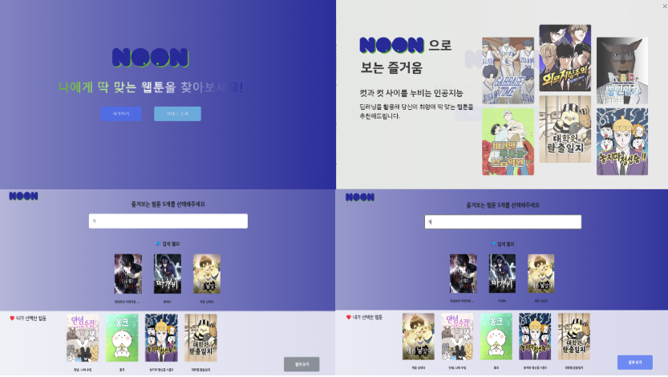
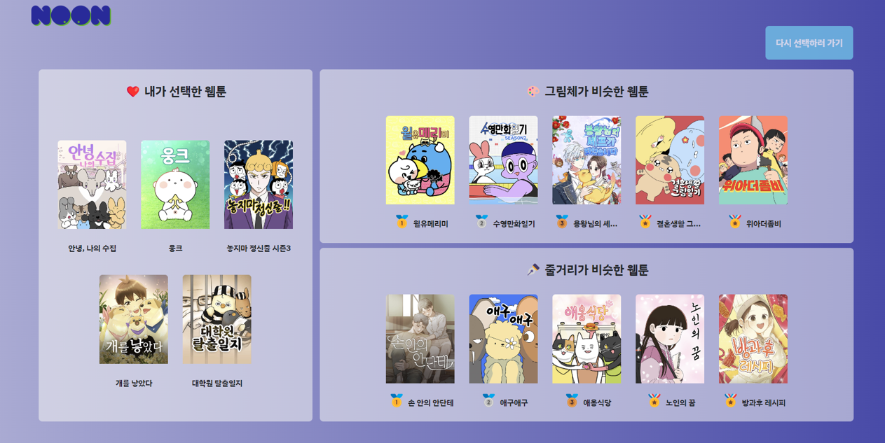
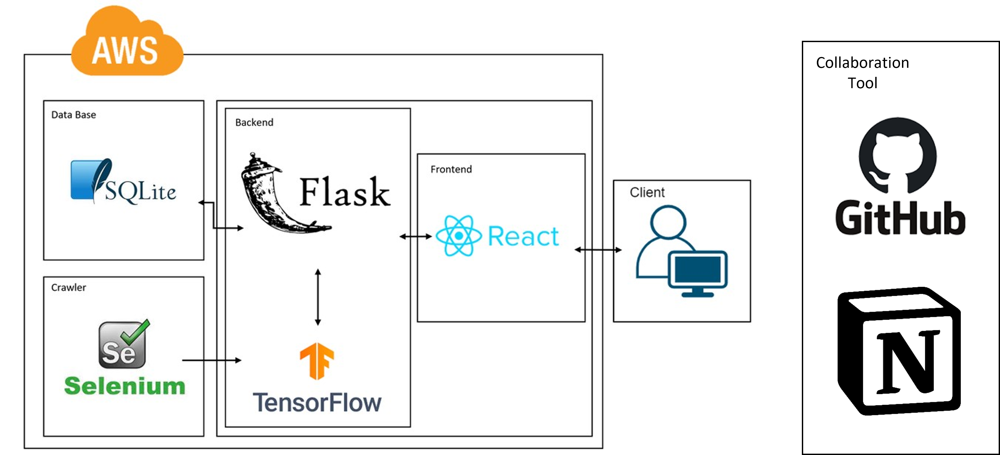

# 😶‍🌫️ 눈으로 보는 즐거움에 대해, NOON

## 📊 빅데이터와 함께 당신의 네이버 웹툰 취향을 알아보세요!
## 🤖 컷과 컷사이를 누비는 인공지능, 딥러닝을 활용해 당신 취향에 딱 맞는 웹툰을 추천해드립니다.

## 👍 로그인없이 추천 웹툰만 간편하게 알아보세요!


## 🗂️ 프로젝트 소개
### 1. 데이터 분석
#### 1) 데이터 수집
- Selenium과 BeautifulSoup4를 활용해 웹 크롤링을 진행했습니다.
- **줄거리 기반 유사도 측정 시 활용 데이터**
➡️ 웹툰 제목, 웹툰 소개글, 웹툰 태그
- **그림체 기반 유사도 측정 시 활용 데이터**
➡️ 각 에피소드의 썸네일 이미지

#### 2) 데이터 전처리
- **줄거리 기반 유사도**  
➡️ **문자열 수정** : 해시태그와, 줄거리 부분을 문자열로 수정했습니다.  
➡️ **해시태그 삭제** : "최강", "공모전"이 들어간 해시태그, 출현 빈도가 2회 이하인 해시태그  
➡️ **해시태그를 장르와 태그로 구분**

- **그림체 기반 유사도**  
➡️ **대표 썸네일 대신 에피소드 썸네일 활용** : 대표 썸네일은 실제 그림체와 차이가 있기 때문에 정확도를 높이기 위함입니다.  
➡️ **에피소드 수가 90개 이상인 작품만 추출** : 그림체 학습에 대한 정확도를 높이기 위함입니다.  
➡️ **`ImageDataGenerator`를 활용한 데이터 증식**


#### 3) 데이터 모델링
- **줄거리 기반 유사도**  
➡️ **KLUE_NLI와 KorSTS 데이터를 활용해 Pre-trained 된 Sentence_Transformers 모델 사용**  
➡️ **cosine similarity를 통해 문장 간 의미적 관계를 수치로 표현**  
```
줄거리 유사도 
= 소개글 가중치(0.45) * 소개글 유사도 + 장르 가중치(0.45) * 장르 유사도 + 태그 가중치(0.1) * 태그 유사도
```

- **그림체 기반 유사도**  
➡️ **`ResNet101V2`를 활용해 성능을 55%까지 향상**  
➡️ **하이퍼 파라미터 조정(이미지 target size)**  
 `(64 * 64) -> (202 * 120) -> (224 * 224)`

****
## SYSTEM ARCHITECTURE

****
## HOW TO START
### Front
```npm run start```

### Back
```python -m flask```

